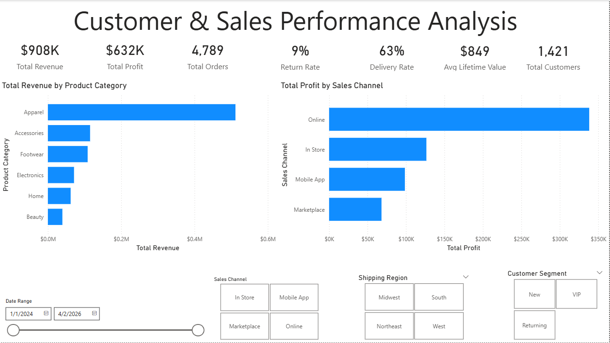
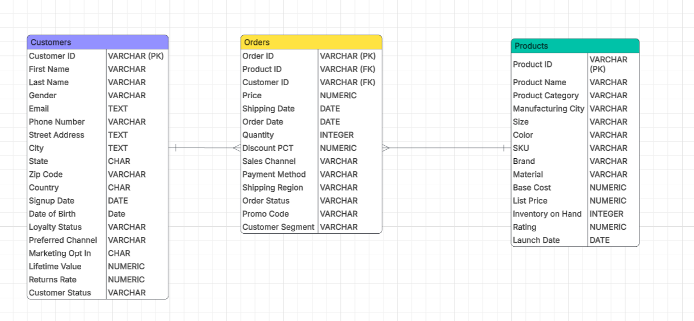
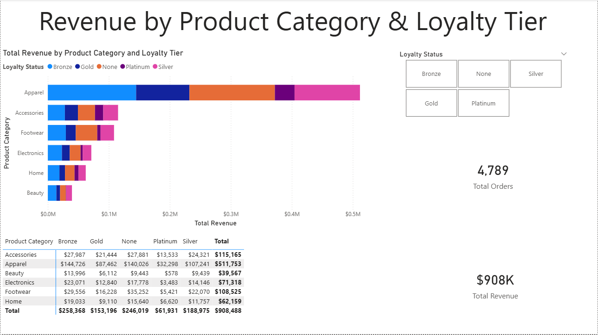
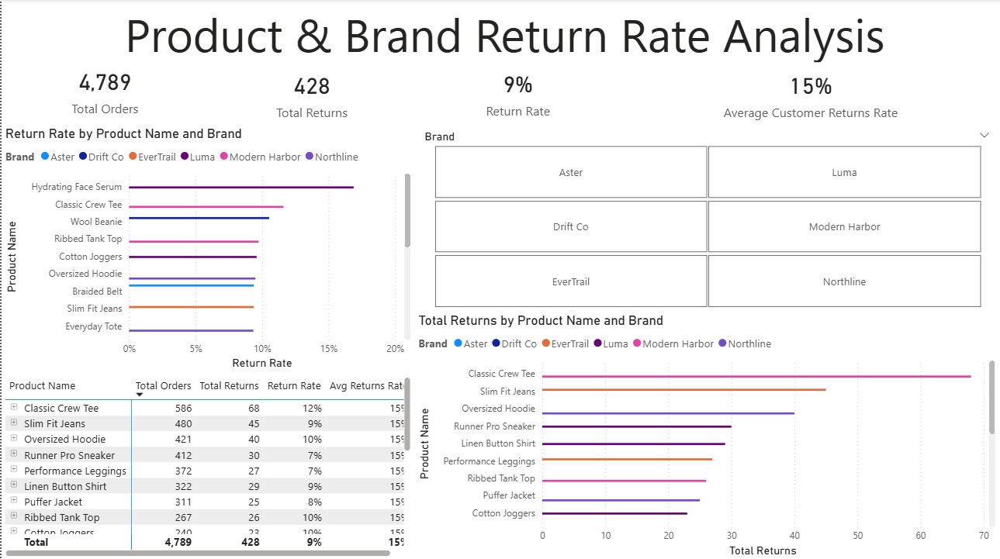
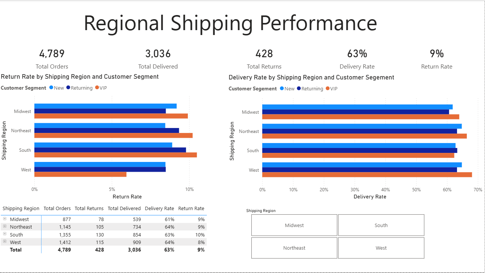
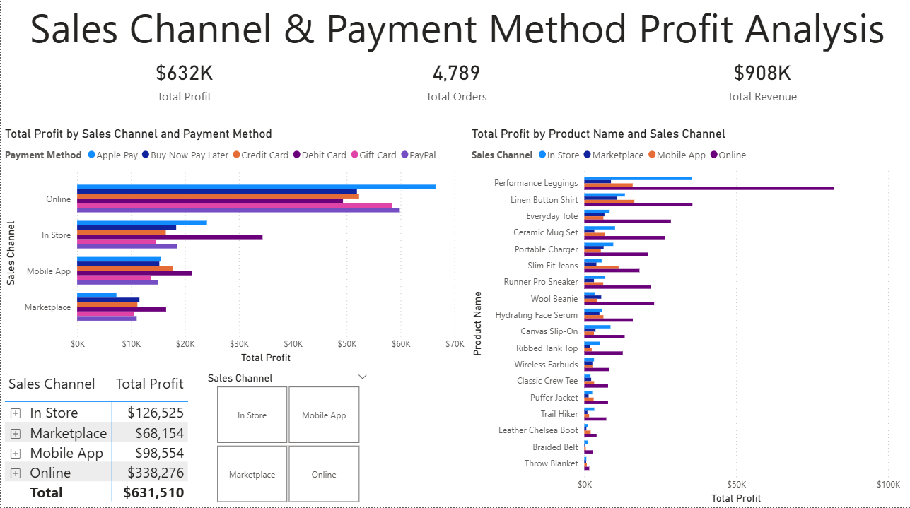
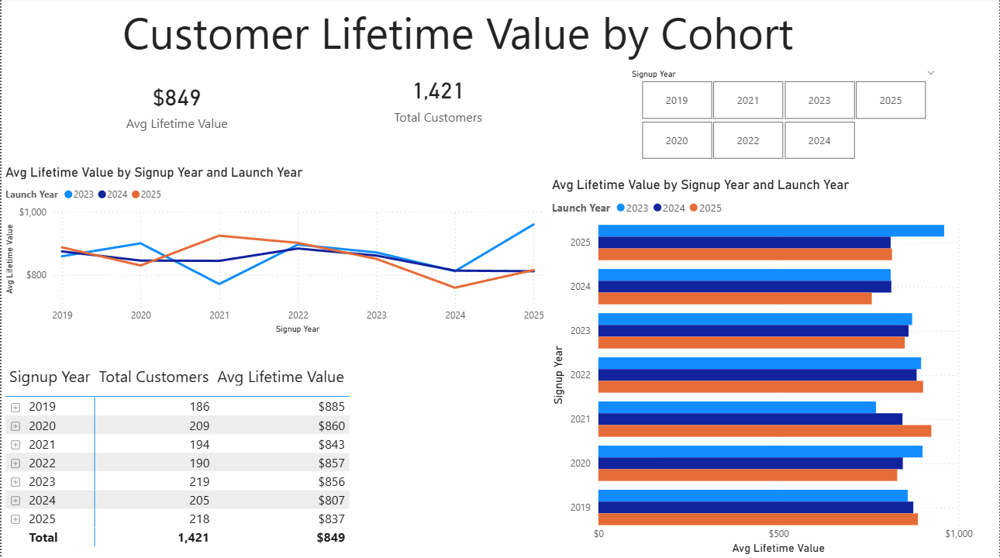

# Customer & Sales Performance Analysis
---
## Project Background

The objective of this analysis is to identify patterns in **revenue generation, product return behavior, and customer lifetime value** that could help retail administrators and business analysts improve operational efficiency and commercial decision-making.

This project applies retail analytics techniques to a **simulated real-world retail dataset** to demonstrate how a retail organization might evaluate customer purchasing behavior, product performance, sales channel efficiency, and regional shipping operations.

The analytical workflow mirrors the type of analysis commonly performed by data analysts working within retail and e-commerce organizations. The analysis focuses on understanding how customer loyalty, product categories, sales channels, and regional shipping patterns influence revenue outcomes, profit margins, and long-term customer retention.

Retail and e-commerce organizations typically monitor several operational and financial metrics when evaluating performance, including:

* Product revenue and profit margins by category and sales channel
* Customer return rates and return behavior by product and brand
* Regional shipping performance and delivery efficiency
* Customer lifetime value and loyalty tier distribution
* Sales channel and payment method profitability

This project demonstrates how these types of metrics can be analyzed using SQL and data visualization techniques to support data-driven decision making.

### Key Analysis Areas

Insights and recommendations are provided across the following key areas:

- **Revenue Distribution by Product Category and Customer Loyalty Tier**
- **Product and Brand Return Rate Analysis**
- **Regional Shipping Performance by Product Category and Customer Segment**
- **Sales Channel and Payment Method Profit Margin Analysis**
- **Customer Lifetime Value by Signup Cohort and Product Launch Year**

### Tools Used

- SQL and Power BI
---

### Supporting Resources

SQL queries regarding data cleaning procedures can be found here:
**[SQL Data Cleaning Queries](code/)** 

SQL queries regarding business questions can be found here:
**[SQL Analysis Queries](code/retail_customer_sales_analysis.sql)** 

The raw and clean retail datasets can be found here:
**[Retail Datasets](data/)**

An interactive Power BI dashboard used to explore trends and insights can be found here:
**[Power BI Dashboard](dashboard/)**

### Dashboard Preview

---

### Data Structure & Initial Checks

The dataset used in this project consists of synthetic e-commerce transactional and customer records designed to simulate operational retail data. After cleaning and preprocessing, the dataset contains **4,982 order records, 1,688 customer profiles, and 20 product listings** with multiple variables related to customer demographics, purchasing behavior, product performance, and sales operations.

### Main Data Structure

The analysis datasets consists of three primary analytical tables derived from retail records.

### Initial Data Quality Checks

Several preprocessing and validation steps were performed before analysis:

* Removed **42 duplicate records across the three files (18 duplicate order IDs in the orders file, 22 duplicate customer IDs in the customers file, and 2 duplicate product IDs in the products file)**

* Standardized null representations, which appeared in up to **7 inconsistent forms per field (blank, nan, NAN, Nan, NULL, Null, [null], and None),** and confirmed missing value counts across all fields in each file

* Removed records containing negative numeric values, including **279 orders with negative prices, and 24 customers with negative lifetime values**

* Standardized categorical fields affected by inconsistent casing and formatting, including **sales channel, payment method, shipping region, order status, customer segment, loyalty status, preferred channel, customer status, country, state, and city**

* Standardized date fields to a single format, resolving up to **5 competing date formats found in order dates, shipping dates, customer date of birth, and signup dates**

* Removed leading and trailing whitespace from string fields across all three files, affecting hundreds of records in **name, email, address, and categorical columns**

* Identified customers with placeholder or invalid phone numbers **(e.g., 000-000-0000, 9999999999)** and email addresses with inconsistent casing

* Standardized the marketing_opt_in field, which used **4 different representations for a binary yes/no value (Yes, Y, No, N)**

* Verified that **shipping dates occurred after order dates**, and **signup_dates occurred after date_of_birth dates**

These steps ensured the dataset was clean and suitable for exploratory analysis.

---

# Executive Summary

### Overview of Findings

Five key insights emerged from the analysis of customer orders, product performance, and sales operations data:

1. **Apparel is the dominant revenue-generating category across all loyalty tiers**, with Bronze loyalty customers contributing the highest total revenue of $144,786.95 — surpassing Gold and Platinum tiers.
2. **The Hydrating Face Serum by Luma carries the highest actual return rate at 17%**, while the Classic Crew Tee by Modern Harbor accounts for the highest absolute volume of returns at 67 units.
3. **The Beauty category exhibits the most volatile shipping performance across all regions**, recording return rates as high as 40% in the Midwest and 100% in the Northeast among VIP customers.
4. **Performance Leggings sold Online via Gift Card generate the highest total profit at $20,107.61**, with the Online channel consistently dominating profitability across payment methods.
5. **Customers who signed up in 2023 and purchased products launched in 2023 show the highest average lifetime value of $913.38 among recent cohorts.**

For retail leadership, these findings highlight the importance of monitoring **loyalty tier revenue distribution, product and category return behavior, regional logistics performance by customer segment, sales channel and payment method profitability, and customer cohort lifetime value** to improve operational efficiency and commercial decision-making.

---

# Insights Deep Dive

## Revenue Distribution by Product Category and Customer Loyalty Tier

* Apparel consistently generates the highest total revenue across all loyalty tiers, establishing it as the dominant product category in the business regardless of customer segment.
* Bronze loyalty customers contribute the highest total revenue at $144,786.95, surpassing Gold and Platinum tiers — suggesting that mid tier loyalty customers represent a significant and potentially underleveraged revenue segment worth targeting with retention strategies.
* Gold and Platinum loyalty customers, while generating lower total revenue, likely represent higher value per transaction customers whose long term retention is critical to sustained business performance.
* Understanding revenue distribution across loyalty tiers helps retail administrators identify which customer segments to prioritize for loyalty program investment and targeted marketing campaigns.

## Product and Brand Return Rate Analysis

* The Hydrating Face Serum by Luma carries the highest actual return rate at 17%, indicating a potential product quality or customer expectation mismatch that warrants further investigation by the merchandising team.
* The Classic Crew Tee by Modern Harbor accounts for the highest absolute volume of returns at 67 units, suggesting that high order volume products require closer monitoring even when their return rate percentage appears moderate.
* Products with both a high actual return rate and a high average customer returns rate signal a genuine product quality issue, while products with a high average customer returns rate but low actual return rate suggest the product itself is performing well despite attracting return prone customers.
* Monitoring return behavior at the product and brand level helps retail administrators identify underperforming products, improve product descriptions, and reduce operational costs associated with processing returns.

## Regional Shipping Performance by Product Category and Customer Segment

* The Beauty category exhibits the most volatile shipping performance across all regions, recording return rates as high as 40% in the Midwest and 100% among VIP customers in the Northeast — pointing to potential fulfillment or product presentation issues that disproportionately affect high value customer segments.
* The South region records the highest overall return rate at 10%, while the West region demonstrates the strongest shipping performance with the lowest return rate at 8%, suggesting regional operational differences worth investigating.
* VIP customers consistently show higher return rates compared to New and Returning customers across multiple regions, which is a concerning pattern given that VIP customers represent the highest value segment in the business.
* Understanding regional shipping performance by product category and customer segment helps retail administrators identify logistics inefficiencies, improve fulfillment processes, and prioritize operational improvements in underperforming regions.

## Sales Channel and Payment Method Profit Margin Analysis

* The Online channel dominates total profit across all payment methods, generating $338,276 in total profit — more than double the next highest channel — confirming that digital sales is the most profitable revenue stream in the business.
* Performance Leggings sold Online via Gift Card generates the highest total profit at $20,107.61, demonstrating that specific channel and payment method combinations can significantly influence profitability outcomes.
* The Marketplace channel consistently generates the lowest profit margins across all payment methods and products, suggesting that marketplace fees or pricing strategies may be eroding profitability in that channel.
* Monitoring profit margins by sales channel and payment method helps retail administrators optimize their channel mix, negotiate better payment processing terms, and focus marketing investment on the most profitable channel and payment combinations.

## Customer Lifetime Value by Signup Cohort and Product Launch Year

* Customers who signed up in 2023 and purchased products launched in 2023 show the highest average lifetime value of $913.38 among recent cohorts, suggesting that customers who engage with contemporary product launches at the time of their signup tend to develop stronger long term spending relationships.
* The 2024 signup cohort shows the lowest average lifetime value at $807, which may reflect the fact that these customers have had less time to accumulate purchases compared to older cohorts — making it important to monitor this cohort as it matures.
* Older customer cohorts from 2019 to 2022 demonstrate consistently higher average lifetime values, reinforcing the importance of long term customer retention as a driver of sustained revenue growth.
* Understanding the relationship between customer signup cohorts, product launch engagement, and lifetime value helps retail administrators design more effective onboarding experiences, target new customers with recently launched products, and build loyalty programs that maximize long term customer value.

---

# Recommendations

Based on the analysis and insights identified above, retail management teams should consider the following actions:

* Re-evaluate the loyalty program structure. Since Bronze loyalty customers are outspending Gold and Platinum tiers, the business should investigate whether the current loyalty program is effectively incentivizing higher spend and retention among its most engaged customers. Introducing tiered rewards that better motivate Bronze customers to progress to higher loyalty tiers could unlock significant additional revenue.
  
* Address high return rate products. Products such as the Hydrating Face Serum and Classic Crew Tee should be reviewed for quality issues, sizing accuracy, and product description clarity. Improving product pages with more detailed information and accurate imagery may help reduce return rates and associated operational costs.

* Investigate regional shipping performance. The elevated return rates in the South and Northeast regions, particularly within the Beauty category and among VIP customers, warrant a closer review of regional fulfillment processes, carrier performance, and packaging standards to identify and resolve the root causes of returns.
  
* Optimize the sales channel and payment method mix. Given that the Online channel generates more than double the profit of any other channel, the business should prioritize digital marketing investment and online customer acquisition. Additionally, the low profitability of the Marketplace channel should prompt a review of marketplace fees and pricing strategies.
  
* Develop targeted onboarding strategies for new customers. Since customers who engage with recently launched products at the time of signup show higher lifetime values, the business should design onboarding campaigns that introduce new customers to the latest product launches immediately upon signup to maximize long term revenue potential.
  
* Monitor the 2024 customer cohort closely. The 2024 signup cohort currently shows the lowest average lifetime value at $807. While this may reflect limited time to accumulate purchases, the business should implement targeted retention campaigns for this cohort to improve engagement and lifetime value before it matures.
* Invest in retail data analytics capabilities. Developing stronger data analytics capabilities across sales, operations, and customer management can support better decision-making related to inventory planning, customer retention, and channel optimization.

---

This project demonstrates how retail data analytics can be used to evaluate customer purchasing behavior, product performance, and sales channel profitability, while illustrating how analytical insights can support operational and financial decision-making in retail and e-commerce organizations.
